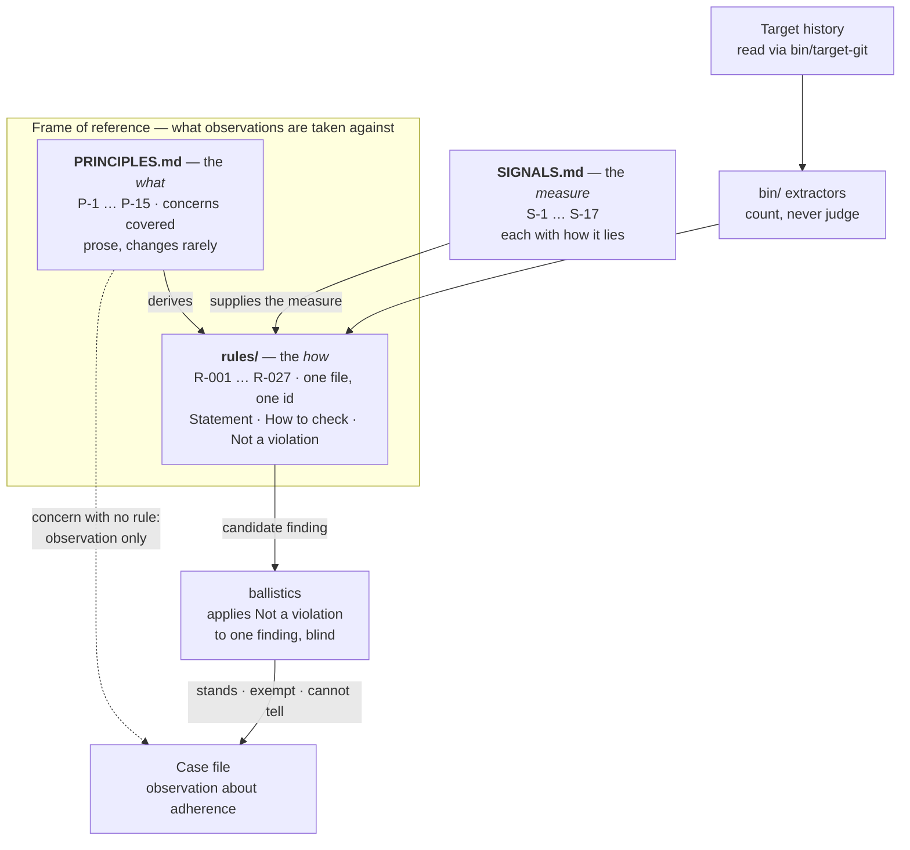

# Principles and rules

<!-- SPDX-License-Identifier: CC-BY-SA-4.0 -->
*This directory is licensed CC BY-SA 4.0, not Apache 2.0 like the rest of
the repository. A derived frame stays inspectable — see [`LICENSING.md`](../LICENSING.md).*

## The principles at a glance

Fifteen candidate principles, each with the rules derived from it, the
**producer signature** whose departure it is most sensitive to, and what it
**reads** from history. The signatures are a reading aid, not a taxonomy the
rules enforce; a rule cites a principle, never a column here.

- **Human**: a reader or decider had to be present. The concern is that
  nobody could have been.
- **Synthetic**: the shape of generated output — fast, voluminous, headless,
  unlabelled.
- **Agentic**: autonomous multi-step behaviour — loops, spawning, reaching
  wide, never finishing.
- **Mechanic**: the process is carried by machinery rather than by people,
  or ought to be.

| Id | Principle | Rules | Signature | Reads |
|---|---|---|---|---|
| P-1 | Work that outruns digestion is not done | R-001, R-004, R-006 | Human absent, synthetic pace | Time |
| P-2 | Where the repository holds the reasoning, code arrives with it | R-003 | Synthetic | Content |
| P-3 | A specification and its implementation landing together means no decision happened between them | R-002, R-005 | Agentic | Time |
| P-4 | The history says truthfully what produced the work | R-007 | Mechanic, undeclared | Record |
| P-5 | Care is proportional to what is at stake | R-008 | Human judgement against uniform care | Content |
| P-6 | Discipline belongs to the system, not to whoever is currently in it | R-009 | Mechanic, missing | Structure |
| P-7 | Documentation must be readable in the part a reader needs | R-010 | Synthetic prose | Content |
| P-8 | Where the repository verifies its work, code arrives with its verification | R-011, R-027 | Synthetic pace | Content |
| P-9 | A process that never revisits does not correct | R-012, R-013, R-026 | Agentic thrash | Trend |
| P-10 | Work begun is work owed | R-014, R-015 | Agentic spawning | Trend |
| P-11 | An increment must be separable to be reviewable | R-016 | Agentic reach | Structure |
| P-12 | The record must describe the change it carries | R-017, R-019, R-020 | Synthetic labels | Record |
| P-13 | Removal must give a reader time to leave | R-018 | Human, downstream | Time |
| P-14 | Care must rise where the repository says risk rose | R-021, R-022, R-023 | Human judgement against uniform care | Trend |
| P-15 | Rigor must not erode as pace rises | R-024, R-025 | Synthetic pace, agentic scale | Trend |

Rules under P-1 to P-4 are active; every rule under P-5 to P-15 is draft. Two
things the table makes visible: the active rules are all human-absent or
synthetic-pace readings, where the evidence in git is strongest, and the
agentic column is entirely draft, because those shapes are the newest and the
calibration histories held the fewest of them. P-5 and P-14 read the same
thing — uniform care where judgement should vary — once from a declaration
and once over time.

## How the frame fits together

A principle names a concern. A rule says how to look for it and what would
innocently explain what it finds. A signal is the measurement a rule leans on,
catalogued with how it misleads. The dotted edge is the one worth noticing: a
concern reaches the case file only as far as its rules allow: a **draft** rule
(R-008 to R-027) arrives as an observation, and so does a signal with no
rule behind it. **No active rule, no finding.**

Two layers, on purpose.

Together these files are Heimdall's **frame of reference**: what its
observations are taken against. Not a set of beliefs the instrument holds — a
declared scope of concerns, replaceable, that determines what becomes visible.

**`PRINCIPLES.md`** names the concerns Heimdall covers: the small number of ways
work can go wrong that this instrument is built to investigate. Prose. They are
the *what*, and they change rarely.

**`SIGNALS.md`** holds what can actually be measured from a repository's
history, what each measurement suggests, and how each one lies. Signals are not
rules — nothing in there is a violation. They are the evidence rules will be
built on, and every one of them carries a confound worth knowing before you
trust it.

**`rules/`** holds discrete, checkable rules derived from those principles. One
file per rule, each with a stable id. They are the *how*: what can be looked
for, and what would innocently explain it. A rule yields observations about
adherence — never a determination that a principle was breached, which is the
reader's to make.

The split matters because it is what makes a case file auditable. "This increment
violated R-012" can be argued with — someone can open R-012, read what it
requires, and disagree. "This increment felt rushed" cannot.

## Writing a rule

**Measure first. Write the rule second. This order is the house order and it is
not a preference.**

1. **Build or extend the extractor, and run it on real history** — including at
   least one repository that did not prompt the idea.
2. **Read what it returns, starting at the top of the list.** The outliers are
   where the exemptions live.
3. **Then write the rule**, carrying the exemptions the run revealed, and making
   them mechanical wherever the run showed they can be.
4. **Set thresholds last**, from the distribution rather than from taste.

The reason is specific. A rule written first encodes what its author *imagined*
the top of the distribution looks like; a rule written after a run encodes what
is actually there. The difference lands in the *Not a violation* section — the
longest and most important part of any rule here — because **exemptions are
discovered, not designed.** Nobody imagines the innocent explanations as well as
one run will show them.

The evidence is in this repository's own history, and it runs both ways. R-010
and R-011 were written after their measurements existed: `reading-weight`'s first
run put two lookup documents at the top of its list, and the mechanical
non-prose exemption exists because of that run — written the other way round, the
rule would have shipped flagging the two documents that were correctly built for
their purpose. R-008 and R-009 were written alongside their extractors instead:
one has never engaged on any history, and the other shipped blind on every
repository that lands work through pull requests and needed two corrections on
first contact. R-012 to R-016 were built in the house order across three
histories of different landing shapes, and nearly every entry in their *Not a
violation* sections is something a run put at the top of its list — a release
bot's version bump, a snapshot regeneration, a lint sweep, a change landing
with its own tests read as width. One of those runs also found a defect in
the landing unit that R-003, R-009 and R-011 had been using all along (see
*Status*).

**This does not discharge calibration.** The run that informs a rule cannot also
validate it — see *Calibration is not validation* below. Measuring first buys a
better rule, not a validated one, and the debt is the same either way.

Then: copy `rules/_TEMPLATE.md` to `rules/R-0NN-short-slug.md` and fill it in.

- **Ids are permanent.** A retired rule keeps its id and gets
  `status: retired`; it is never reused or renumbered. Old case files cite ids,
  and a reused id silently rewrites history.
- **A rule must be checkable.** If you cannot describe what evidence would show
  it violated, it is a principle, not a rule — put it in `PRINCIPLES.md`.
- **`status: draft` is not enforceable.** Draft rules may be raised as
  observations during an assessment, never as violations. Promote to `active`
  deliberately.
- **Severity is about consequence, not confidence.** How bad is it if this is
  violated — not how sure the assessor is.
- **A finding is read against what adhered.** Every outcome carries its
  denominator: how many comparable units in the window satisfied the rule,
  beside how many did not. "Two landings arrived without a test" is a
  different sentence when the other thirty-eight carried one and when the
  other two did. A rule that signals only what departs invites the reader to
  see a pattern in a count, and the extractors already compute the rate —
  the case file must print it.
- **Prefer the framing whose cheapest evasion is the desired behaviour.** A
  rule that can be satisfied by waiting, padding or splitting degrades into
  theatre once anyone knows it exists; a rule whose cheapest satisfaction is
  the practice it was written for degrades into the practice. Both degrade —
  assume disclosure — so where a concern can be checked either way, take the
  second framing. Where only the first is available, say so in *Not a
  violation*: a reader deciding what a passing result means deserves to know
  the result was cheap to buy. The narrative behind this is in
  `docs/concept.md` under *Doing better, or losing the trail*.

## Severities

| Severity | Meaning |
|---|---|
| `blocking` | The increment should not stand as-is |
| `warning` | Should be fixed, does not by itself invalidate the increment |
| `advisory` | Worth knowing; a matter of preference or trajectory |

## A signal is not a rule

Keep the two apart. A signal says what happened; a rule says what should have.
Most signals here have a confound strong enough that a rule resting on the
signal alone would be wrong a good fraction of the time — attribution can be
switched off by the tool it measures, merge lag accuses a healthy workflow that
reviews early and fixes late.

So a rule must name which signals it rests on *and* how it handles their
confounds, in its "Not a violation" section. A rule that reads one number and
declares a violation is the mistake this split exists to prevent.

The order in *Writing a rule* above follows from this. A signal can exist with
no rule — S-6's comment share is one, deliberately and permanently — but a rule
should not exist before the measurement it consumes has been run and read.

## Status

Fifteen **candidate** principles are written, `SIGNALS.md` catalogues
seventeen measurements, and **seven rules are active** — R-001, R-004 and R-006
from P-1, R-002 and R-005 from P-3, R-003 from P-2, R-007 from P-4.

**Twenty rules are in draft**, R-008 to R-027, at least one under each of
P-5 to P-15. All may be raised in a case file as observations and never as
violations, because their thresholds were chosen, or swept against a handful
of histories, rather than calibrated.

**R-008 was retired on 2026-08-31 and restored the same day.** The retirement
was wrong and the reason is worth keeping: it was retired for returning
not-applicable everywhere, which is not a criterion any other rule in this frame
is held to — on the very reading that retired it, four of seven active rules
returned not-applicable. The evidence showed its *partition* was unusable
(declared against undeclared needs an undeclared remainder), not that its
question was. Revised to compare levels within the declaration instead. Signal
S-7 was kept: it reports the declaration on every repository that has one,
including those where the rule cannot run.

**The landing unit was wrong on squash-merge repositories until 2026-09-02,
and three rules read through it.** R-003, R-009 and R-011 share one unit of
measurement: a merge counts once by its first-parent diff, and runs of
consecutive direct commits are grouped into one landing by a time gap. On a
repository that lands by squash, every trunk commit is a direct commit, so
independent pull requests merged within an hour of each other were welded into
one landing. Found by R-016's extractor, the one rule for which fusing two
landings changes the answer by an order of magnitude: a one-file dependency
bump read as 586 files across 18 areas. Measured on one large history over a
year: 722 binned landings became 1,131 and R-011's candidate list grew from
152 to 227. A commit whose committer is the hosting platform is now its own
landing in all six scripts that carry the unit — R-003's own extractor had
its own copy of the grouping and the same defect. **Re-swept the same day**
across five histories of different landing shapes, about 2,180 landings: the
gradient the first sweep reported as monotonic is a climb to a plateau — the
test rate sits at 74-80% above 100 lines on every history, and the 300-999
and 1000+ bands move in no consistent direction from 100-299. R-011 now
judges the bands from 100 lines up against their pooled rate and reports them
separately; the 25-99 band, where the five histories straddle the convention
bar, is judged on its own. R-003 does **not** pool: the reasoning rate keeps
a gradient at the top — rising into 1000+ on two histories, falling on one —
and pooling it demoted a 62% band to "below the bar" on the fifth history, so
the siblings differ on this one point for a measured reason. Bands, bar and
floors otherwise kept.

**R-003 and R-011 did not agree on what a line of code was, until
2026-09-02.** Surfaced by the same sweep: R-003's extractor counted code by an
extension allowlist and left 154 of 298 landings on one history unbinned,
where R-011's counted anything not test, documentation or noise and binned
248 of them — and every script that bins by size carried its own copy of the
patterns, drifted: `spec/` a test directory in one and a documentation
directory in another, `.txt` documentation in some and code in the rest,
fixtures noise only in the newest. `bin/classify.py` is now the one
definition, imported by the twelve scripts that need it, with the order of
tests stated as the definition. Verified on the history that exposed it: the
two rules now bin the same landings into the same bands with identical rates,
the only difference being the doc-dominant landings R-003 excludes by design.
Configuration still counts as code, deliberately — excluding it would move
landings between bands and invalidate the sweep, and the rules already carry
it as an exemption; a config class is a future change with its own re-sweep.

**R-008** (P-5) is the first rule in the frame to take its standard from the
target's own declarations rather than from Heimdall: it compares the review
window given to `CODEOWNERS`-declared paths against everything else in the same
repository.

**R-009** (P-6) is the first whose finding concerns durability rather than what
happened in the window — a practice the repository plainly relies on, with
nothing in the tree to keep it going if the people changed. It is also the first
written specifically to *avoid* a measurement: the direct reading of P-6 would
compare contributors, which P-6 forbids, so R-009 asks the same question of
configuration instead.

**R-010** (P-7) asks whether documentation can be *read*, which none of the
others do — R-003 checks that reasoning is present and R-005 that a document's
claims stay true, and a repository can satisfy both with files nobody can
navigate. It is the first rule to measure the shape of an artifact rather than
an event in history, and the first to admit in its own text that a passing
result is cheap to buy: the cheapest way to clear it is to add headings, which
helps only when they name what is beneath them.

**R-012 and R-013** (P-9) are the first rules that look for the shape of
correction rather than the presence of a defect: work backed out and returned
byte-identical, and a file replaced three times in one window. R-013 is stated
against its own retired ancestor and prints the ancestor's figure beside its
own, so that a reader can see one saturates and the other does not.

**R-014 and R-015** (P-10) are the first rules that look at what did *not*
land — branches that never arrived, obligations written and not discharged.
Both are conditional in the R-003 shape, and on three histories each stood
down once for the right reason, which is the property that matters most in a
conditional rule.

**R-016** (P-11) is the first rule whose cheapest evasion is the practice it
was written for: splitting the change. It is also the first to have had its
criterion rejected twice by its own runs — a percentile that flags a fixed
share of any distribution, then a multiple of the median that collapses onto
the floor — before settling on all three conditions at once.

**R-017** (P-12) is the first rule about a merge's *content* rather than its
timing: it recomputes what git would have produced and reports what the
merge landed beyond that, outside any conflict. On two merge-commit
histories it found one four-line fix-up and 441 clean merges, and stood down
on a squash history.

**R-021 to R-025** (P-14, P-15) are the first rules that read the repository
as a time series rather than a window, from one shared series computed by
`bin/care-over-time`. Every one says *cannot tell* on a young or quiet
history and the texts make that ordinary. R-021 is the natural experiment an
ownership declaration hands over — care on the declared paths before and
after the declaring commit — and on four real histories it never found a
declaration broad enough to populate, engaging only on fixtures built for
it. R-026 (P-9) is the small learning rule: a re-land after a revert, in a
repository that ships tests, carrying the test the first attempt lacked.

**R-019 and R-020** (P-12) are the first rules about a commit's *label*. R-019
learns where a repository keeps its source and its tests from which of its
own typed landings touch which directories — by frequency, because by churn
share a good `fix:` commit's tests make the test directory look like source.
R-020 is the first rule in the frame whose survivors on first contact were
the shape it describes: a "types cleanup" of 1,822 lines, a "clean up … a
bit" of 1,116.

**R-027** (P-8) is the first rule to use a code measurement as anything but a
line count: the decision points a landing added, net of those it removed,
counted by token on the diff. It began as research into the cyclomatic
number — a poor product metric by the literature's account, and outperformed
by process measures — and survived only as a second size axis for R-011's
question, in the zone under 100 lines where R-011 is silent. On four
histories the repositories' own care followed branching more steeply than it
followed lines, which is what licenses the rule; it engaged on one of them.

**R-018** (P-13) is R-002's mirror — the interval after announcing a removal
rather than before building a specification — and the first rule whose
every early false positive became a mechanical exclusion within the same
afternoon: configuration, vendored trees, `internal/`, reverted
deprecations, rewordings.

**R-011** (P-8) is R-003's sibling and closes the gap R-003 leaves: R-003 asks
whether *reasoning* arrived, so a repository could satisfy it wholly on prose
while shipping code nothing checks. Like R-003 it is **conditional** — it
establishes from the window whether this repository ships tests alongside code
at all, and disables itself below the bar. On the one real history tried it
measured 42% and stood itself down, which is the behaviour that matters: a
conditional rule that never declines to apply is not conditional.

They are not equally strong, and a case file should not present them as if they
were.

R-001, R-004, R-002 and R-006 test a **necessary condition**: they show that
reading, deciding, or keeping up was *not possible* in the time available. None
claims a person failed to do it. R-007 rests on the same arithmetic from the
other side — pace that proves machine production — and then asks only whether
the history admits it; it is the one rule allowed near the attribution signal,
and only because pace, not attribution, carries it. That is a smaller claim than it first appears, and it is why
both can stand without knowing anything about intent — no explanation undoes an
interval that did not exist.

R-005 is split down its middle, and says so: its phantom half is a hard fact (a
named file that does not exist), its drift half is a bounded inference cited as
a rate. It is also the one rule that reads repository *state* at a ref rather
than an increment, because rot is invisible in any single increment.

R-003 is weaker. It asserts only that a file did not change within a particular
increment, and there are innocent reasons for that — reasoning written earlier,
reasoning carried in the commit message, work that owes no explanation. It is
also the only **conditional** rule: it establishes from practice that a
repository keeps its reasoning in-tree at all, and disables itself where that is
not the norm. Read it as a pointer to where to look, never as a conclusion.

R-001 and R-004 come from the same principle and share a check, and they are
still two rules. A branch has a review window; a trunk commit has none. Under one
id a case file could not say which claim it was making, and "no review window
existed" and "nobody could have kept up" call for different responses. **Split a
rule when the sentence a case file has to write differs**, not when the measurement
differs.

A rule that cannot say what would innocently produce its finding is not ready to
be active. That is what the "Not a violation" section is for, and why it is the
longest section in every one of them.

## Known gaps in what the rules can express

Recorded so that case files can compensate in prose for what the tables cannot
say. Each is a future rule candidate, none is patched yet.

- ~~**Remediation blindness.**~~ **Narrowed** by P-9 and its two draft rules,
  which look for the shape of correction — a revert, a re-land, a rewrite —
  and S-8, which reports how much of a window is reversal or repair. What
  remains, and is permanent from git alone: a rule can see that correction
  *happened*, never credit a range for it, because fix-forward work that
  names nothing is indistinguishable from any other change. A case file
  should still state direction of travel in prose whenever a dated convention
  change sits in or at the edge of the range.
- **Verification blindness.** *Narrowed, not closed.* S-12 inventories the
  gate chain the tree declares — pipelines, hooks, linters, test runners — and
  whether it moved with the work, so a repository with a battery of checks no
  longer reads identically to one with none. What it cannot see, and no rule
  should pretend to: whether any of it runs. A workflow disabled at the
  platform reads identically in git; required checks and branch protection
  live on the forge. S-12 has no rule and none is proposed.
- **What was started and not finished.** *Newly covered, weakly.* P-10 and
  its two rules read branches that never landed and markers never discharged.
  Both are floors: work begun, abandoned and deleted is invisible, and the
  branch reading is meaningless on a repository that keeps refs after landing,
  which R-014 detects and stands down on.
- ~~**No rule asks whether tests arrived with the code.**~~ **Closed** by P-8
  and R-011 (draft). Raised by a field run that watched tests land with their
  subject throughout an arc with nothing in the frame able to say so, and
  independently by noticing that `bin/unenforced-practice` already computed the
  rate for R-009 — where it answers who *carries* a practice — while no rule
  asked whether an increment had one. What remains open is narrower and belongs
  to R-011's own limitations: verification that is not a test file (type
  checking, schema validation, a gate script, a compiler) stays invisible, so a
  repository that verifies by construction reads as untested.
- **Review-window blindness on forge-mediated landings.** *Partly closed, and
  the residue is permanent.* A pull request accepted by squash or rebase leaves
  one commit and no branch, so the interval that would prove a review window
  existed is on the hosting platform, not in git. The instrument used to read
  such landings as direct-to-trunk pushes and produced 119 false R-004 findings
  over 295,341 lines on a repository that reviews 96% of its work — reporting
  100% direct against a true figure near 2%. What is closed: the landings are
  now identified by committer identity and reported as **not measurable**, and
  R-002 and R-006 exclude them rather than reading merge cadence as work
  cadence. What is not, and cannot be from git alone: on such a repository
  R-001 examines nothing, so **the entire review history is out of reach** and
  a case file must say so rather than showing a clean sweep. This is the
  strongest standing argument for an evidence bundle. A residual failure mode
  remains — a hosting platform whose committer identity is not in
  `FORGE_COMMITTERS` degrades to the old wrong answer, so
  `bin/reviewability` prints the committers behind the landings it calls
  direct, for a person to notice.
- **Differentiated care is barely measurable.** *Narrowed, not closed.* Every
  rule but R-008 applies one threshold to every path, so a repository careful
  where it counts and quick elsewhere scores identically to one that is
  uniformly quick. R-008 is the only rule that can see the difference, and after
  a revision it can now at least *form* the comparison on a repository that owns
  everything — it compares levels within the declaration rather than declared
  against undeclared. It has still never been populated: the one target with a
  real gradient had 2 measurable merges above its median owner count against a
  minimum of 3. What remains open is a validating target, not a design.
- **Production-time blindness.** Commit timestamps record when commits were
  made, not when work was done. Rules that reason from pace (R-006, R-007)
  cannot distinguish work produced inside the measured window from work built
  slowly and landed in a burst, and on build-then-land workflows their findings
  will mostly be undecidable from git alone. The deciding evidence — session
  transcripts, push timestamps, intermediate CI runs — would arrive through an
  evidence bundle, which remains the standing argument for one.
- **Sensitive material in history.** Deleting a file from the tree does not
  remove it from history: a data dump or credential committed once remains
  retrievable at every earlier ref, and no rule looks. Nominated as a candidate
  by the first arm's-length assessment, which found production-named database
  dumps deleted in a cleanup commit and correctly recorded the deeper fact —
  that they had been tracked at all, and still are, at any ref before the
  cleanup. Held as an observation until it recurs: one instance in one
  repository is not yet a pattern worth a rule id, and a rule here would also
  need to decide whether it is Heimdall's concern at all or a security
  scanner's — a boundary this instrument has so far kept deliberately.
- **Quiet is not idle.** Absence of activity in the clone is not evidence of
  absence of work. A window with nothing in it may be work on a fork, on a
  branch not pushed, in a design conversation, or deliberately parked; and a
  branch with no commits for a month is a branch that did not land *here*,
  not one that stopped. No rule reads silence as a finding, and none may:
  a quiet window yields not-applicable across the board, and a case file
  must say "the record shows nothing landed" rather than "nothing happened".
  R-014 is the rule nearest the edge, and its extractor's own summary once
  said "not finished" where git supported only "did not land"; reworded on
  2026-09-04, with the cross-reading delta added so the rule can at least
  see the stock move.
- **Forge blindness.** Review approvals and discussion live on the hosting
  platform, outside git. Rules about reading windows can claim an interval was
  short, never that platform review did not happen (stated in R-001).
- **The frame assumes one shape of deliberation.** R-002 tests *specification →
  interval → code*, and that is one way a repository can show a decision was
  made rather than assumed. It is not the only one and not the best one. A
  numbered open question raised in one commit and resolved in a later one
  carries the question, the interval, the answer and the reasoning that closed
  it — more of the deliberation than two files landing a day apart — and no
  rule can see it. The same blindness covers issue threads, ADR status moving
  from proposed to accepted, and review conversation on the forge.

  R-002 now carries this as an exemption, which is the right place for it: the
  shapes it cannot see are *better* records than the one it tests for, so
  widening the check would flag good practice. What is missing is any rule that
  can give a repository credit for them, and a case file should say so rather
  than let a clean R-002 imply that deliberation was found.
- **The leak guard cannot read anything that is not text.** `check-no-leak`
  greps tracked files, so an image, a PDF, an archive or any binary passes it
  regardless of contents. A screenshot of the target, or a target's name sitting
  in an image's XMP packet, would sweep clean — with every content rule
  satisfied, which is the shape of leak this repository has already been caught
  by twice in ref names. Nothing detects it today and the mitigation is
  procedural: binaries are rare here, and one entering the repository is a
  moment to look by hand. Noticed when the first image was added, whose metadata
  carried its author's editing tool, platform and a persistent document
  identifier — none of it about a target, and none of it visible to the guard
  either.
- **Out-of-band disclosure is undetectable.** The observer-awareness check in
  `/stakeout` searches the *target* for traces of its assessor — the
  instrument's name, rule ids, advice recorded as having been received. That
  catches disclosure that left a mark in the repository. It cannot catch the
  likeliest route by far: a case file read aloud in a retrospective, or
  summarised in a chat message, after which the team optimises against rules
  the repository never mentions. The check therefore establishes only that no
  disclosure was *recorded*, never that none occurred, and a case file should
  not report a clean observer-awareness result as evidence of independence. No
  rule can close this; only knowing how the previous case files were used
  can.

## Calibration is not validation

These rules were calibrated against real history: thresholds swept on it,
exemptions discovered by assessing it. A repository that shaped the rules cannot
then independently validate them — a case file finding it broadly well-behaved is
partly self-assessment, and says little about whether the rules generalise.

So a case file on any repository that influenced `principles/` must say so in its
limitations, and the rules only earn confidence as they are applied to
repositories that had no hand in them. Until then, a clean case file is evidence
about the repository or about the rules, and cannot fully separate the two.
